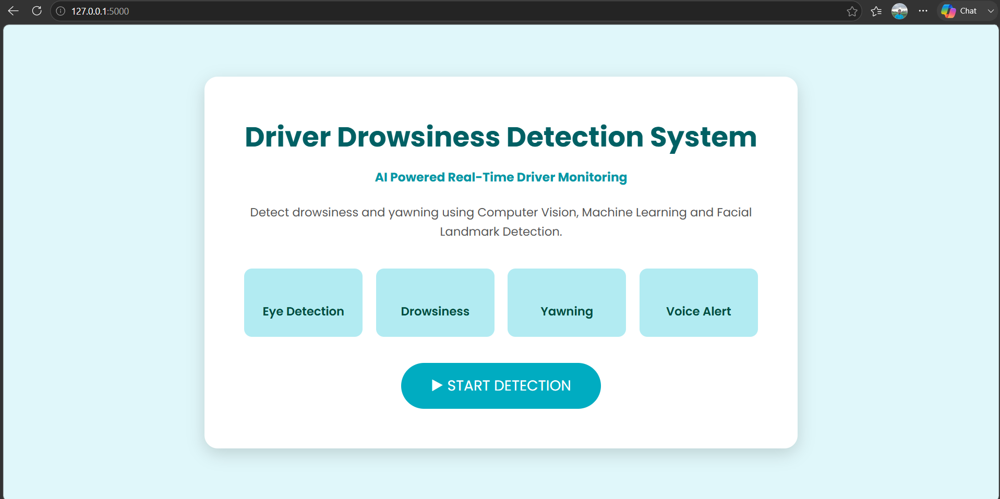
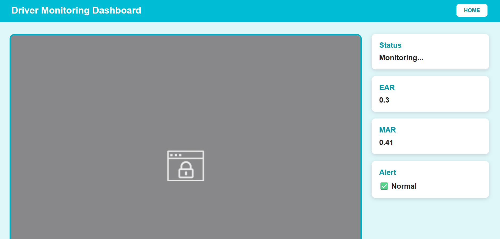
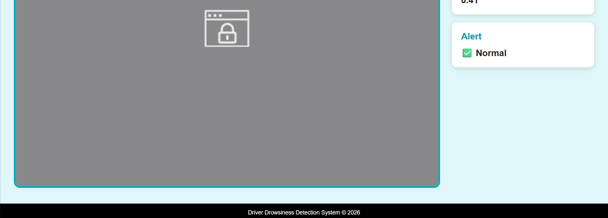

# Driver Drowsiness Detection Web App

A real-time AI-powered Driver Drowsiness Detection Web Application built using **Python, Flask, OpenCV, and dlib**. The system monitors a driver's eyes and mouth through a webcam to detect drowsiness and yawning, providing instant voice alerts to improve road safety.

## Features

- Real-time Eye Aspect Ratio (EAR) detection
- Mouth Aspect Ratio (MAR) based yawn detection
- Voice alerts using pyttsx3
- Live webcam streaming
- Flask-based web interface
- Responsive dashboard UI

## Tech Stack

- Python
- Flask
- OpenCV
- dlib
- SciPy
- pyttsx3
- HTML
- CSS
- JavaScript

## Screenshots

### Home Page


### Detection Dashboard


### Detection Dashboard


## Project Structure

```text
Drowsiness-Detection-Web-App/
│
├── images/
│   ├── 1.png
│   ├── 2.png
│   └── 3.png
│
├── static/
│   ├── css/
│   └── js/
│
├── templates/
│   ├── index.html
│   └── detect.html
│
├── app.py
├── drowsiness.py
├── requirements.txt
└── shape_predictor_68_face_landmarks.dat
```

## Author

**Saveer More**
